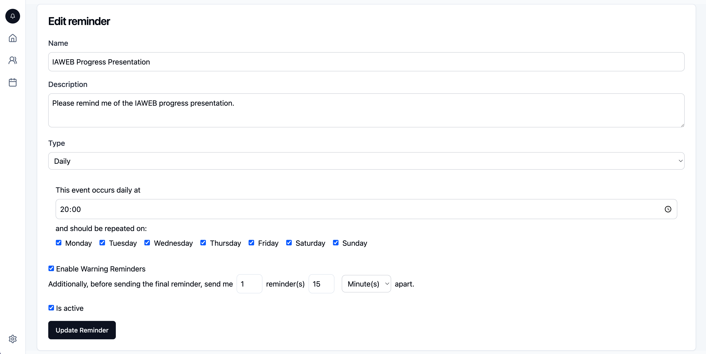

# SelfMemo 2.0

This repository contains the work for VU Information and Web-Architecture 24/25.

SelfMemo 2.0 is an E-Mail reminder service where you can create reminders for different events (daily, weekly, monthly, yearly, ...).



It is the enhancement of the previous project: https://github.com/Self-Memo/SelfMemo

## Getting Started

### Prerequisites
- [GitHub](https://github.com/) Account
- [Vercel](https://vercel.com/) Account
- SMTP Account
- [cron-job.org](https://cron-job.org/) Account
- [Neon Serverless Postgres](https://neon.tech/) Account + DB

### Local Environment
- Clone/Fork this repository
- ```cd``` into the application folder
- Run ```npm install```

Create a ```.env``` file in the root directory of your repository and set the following env variables:\
DATABASE_URL=\
You can use any Postgres database as described in [https://www.prisma.io/docs/orm/overview/databases/postgresql#connection-url](https://www.prisma.io/docs/orm/overview/databases/postgresql#connection-url).

NEXTAUTH_URL=\
The URL, where your application will run. Locally, this should be set to e.g. ```http://localhost:3000```.

AUTH_SECRET=\
Create a secret on [https://generate-secret.vercel.app/32](https://generate-secret.vercel.app/32)

Connect your SMTP-Account. Note that the application is configured to send **secure** emails via port **465**:\
SMTP_USER=\
SMTP_PASS=\
SMTP_MAIL=\
SMTP_HOST=\

For your initial admin-account, set the following variables:\
ADMIN_EMAIL=\
ADMIN_NAME=\
ADMIN_PASSWORD=\

- Run ```npx prisma migrate dev``` to migrate the database schema
- ```npm run dev``` to start your application
- Hit once ```GET http://localhost:3000/api/seed``` in order to create your admin account

Your application should be up and running on localhost:3000 and you should be able to login.

### Deploy the application

Steps:
- Fork this repository on GitHub
- Connect your Vercel to your GitHub account
  - Create a new project in your Vercel account
  - Select "Import Git Repository" (you may need to install the GitHub application)
  - Select this repository fork and click on "Import"
  - Set the following Environment Variables in Vercel:
    - DATABASE_URL -> Retrieve your connection string from Neon.
    - NEXTAUTH_URL -> The URL, where your application will run.
    - AUTH_SECRET -> generate on [https://generate-secret.vercel.app/32](https://generate-secret.vercel.app/32)
    - SMTP_USER
    - SMTP_PASS
    - SMTP_MAIL
    - SMTP_HOST
    - ADMIN_EMAIL
    - ADMIN_NAME
    - ADMIN_PASSWORD
  - Click "Deploy"
  - In your Vercel-Project Settings -> General -> Build & Development Settings, set the "Build Command" to ```prisma generate && prisma migrate deploy && next build```
  - You may have to re-deploy after changing the build command (Vercel Deployments -> 3 dots -> Redeploy)

- Send a request to create admin user: GET https://your-vercel-url.com/api/seed\
You should see "Admin user created".
- Setup cronjob.org and point a cronjob running every minute to:
https://your-vercel-url.com/api/reminders/trigger
- You can now create reminders and users in the application.

References:\
[https://vercel.com/docs/deployments/git/vercel-for-github](https://vercel.com/docs/deployments/git/vercel-for-github)\
[https://vercel.com/docs/deployments/git#deploying-a-git-repository](https://vercel.com/docs/deployments/git#deploying-a-git-repository)\
[https://www.prisma.io/docs/orm/overview/databases/supabase](https://www.prisma.io/docs/orm/overview/databases/supabase)\

## License
The MIT License (MIT)

Copyright (c) 2025 Maria Seiser, Niklas Lorber, Kilian Weisl

Permission is hereby granted, free of charge, to any person obtaining a copy of this software and associated documentation files (the "Software"), to deal in the Software without restriction, including without limitation the rights to use, copy, modify, merge, publish, distribute, sublicense, and/or sell copies of the Software, and to permit persons to whom the Software is furnished to do so, subject to the following conditions:

The above copyright notice and this permission notice shall be included in all copies or substantial portions of the Software.

THE SOFTWARE IS PROVIDED "AS IS", WITHOUT WARRANTY OF ANY KIND, EXPRESS OR IMPLIED, INCLUDING BUT NOT LIMITED TO THE WARRANTIES OF MERCHANTABILITY, FITNESS FOR A PARTICULAR PURPOSE AND NONINFRINGEMENT. IN NO EVENT SHALL THE AUTHORS OR COPYRIGHT HOLDERS BE LIABLE FOR ANY CLAIM, DAMAGES OR OTHER LIABILITY, WHETHER IN AN ACTION OF CONTRACT, TORT OR OTHERWISE, ARISING FROM, OUT OF OR IN CONNECTION WITH THE SOFTWARE OR THE USE OR OTHER DEALINGS IN THE SOFTWARE.